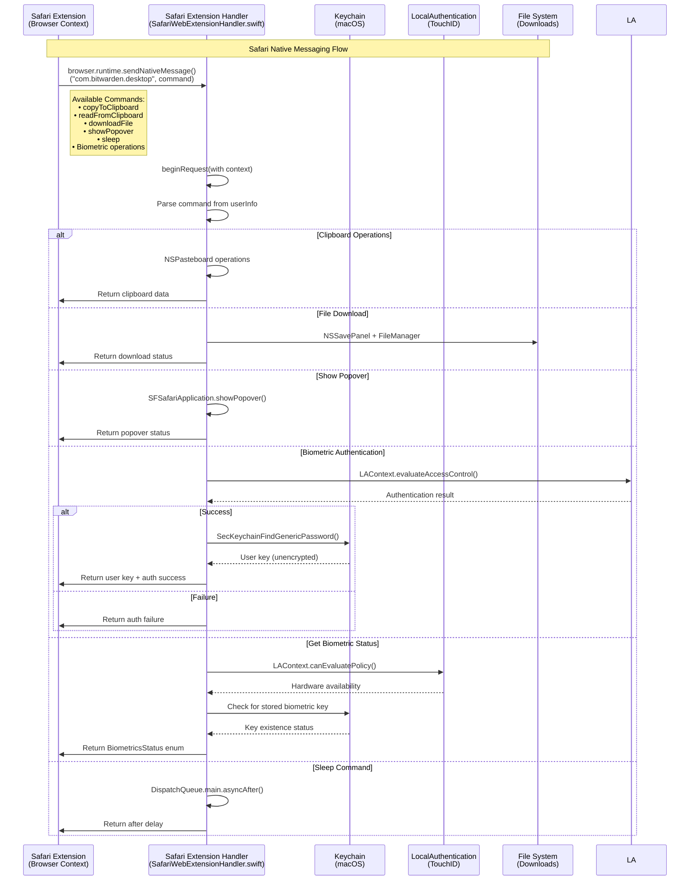

# Bitwarden Safari Extension

This directory contains the Bitwarden Safari Web Extension implementation for macOS.

## Architecture

The Safari extension consists of two main components:

1. **Safari Web Extension** - The JavaScript extension that runs in Safari
2. **Safari Extension Handler** - A Swift native component that handles native messaging and OS integration

## Native Messaging

Safari uses a different native messaging architecture compared to Chrome/Firefox extensions. Instead of communicating with a separate desktop proxy binary, Safari extensions can include a native Swift component that handles system-level operations directly.

### How Native Messaging Works



### Supported Commands

#### System Operations
- **`copyToClipboard`** - Copy text to macOS pasteboard
- **`readFromClipboard`** - Read text from macOS pasteboard  
- **`downloadFile`** - Save files using macOS save dialog
- **`showPopover`** - Control Safari extension popover display
- **`sleep`** - Provide async delay functionality

#### Biometric Authentication
- **`authenticateWithBiometrics`** - Perform TouchID authentication
- **`getBiometricsStatus`** - Check if biometrics are available on device
- **`unlockWithBiometricsForUser`** - Unlock vault with biometrics for specific user
- **`getBiometricsStatusForUser`** - Check biometric availability for specific user
- **`biometricUnlock`** - Legacy biometric unlock command
- **`biometricUnlockAvailable`** - Check if biometric unlock is available

### Main Implementation Files

- **`SafariWebExtensionHandler.swift`** - Main Swift native messaging handler
- **`safari.entitlements`** - Safari extension entitlements and permissions
- **`Info.plist`** - Safari extension metadata and configuration
- **`desktop.xcodeproj/`** - Xcode project for building the Safari extension

### Building

The Safari extension is built as part of the browser extension build process:

```bash
npm run dist:safari
```

This uses the `package-safari.ps1` script to:
1. Build the Safari extension Xcode project
2. Code sign the extension for different distribution types (`mas`, `masdev`, `dmg`)
3. Package the extension for integration with the desktop app