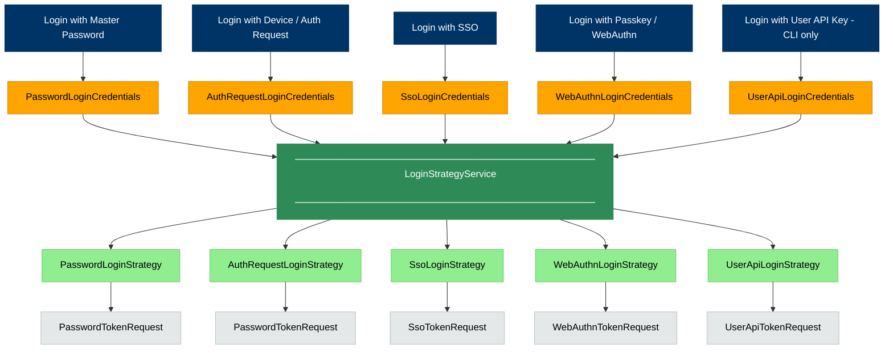

# Overview of Authentication at Bitwarden

<br>

> **Table of Contents**
>
> - [Authentication Methods](#authentication-methods)
> - [The Credentials Object](#the-credentials-object)
> - [The Login Strategy](#the-login-strategy)
> - [The `logIn()` and `startLogin()` Methods](#the-login-and-startlogin-methods)
> - [Handling the `AuthResult`](#handling-the-authresult)

<br>

## Authentication Methods

Bitwarden provides 5 methods for logging in to Bitwarden, as defined in our [`AuthenticationType`](https://github.com/bitwarden/clients/blob/main/libs/common/src/auth/enums/authentication-type.ts) enum. They are:

1. [Login with Master Password](https://bitwarden.com/help/bitwarden-security-white-paper/#authentication-and-decryption) &mdash; authentication and an email address and master password
2. [Login with Device](https://bitwarden.com/help/log-in-with-device/) (aka Login with Auth Request) &mdash; authentication with a one-time access code
3. [Login with SSO](https://bitwarden.com/help/about-sso/) &mdash; authentication with an SSO Identity Provider (IdP) through SAML or OpenID Connect (OIDC)
4. [Login with Passkey](https://bitwarden.com/help/login-with-passkeys/) (aka Login with WebAuthn) &mdash; authentication with a passkey
5. [Login with User API Key](https://bitwarden.com/help/personal-api-key/) &mdash; authentication with an API key and secret.

<br>

- Methods 1-4
  - Can be initiated from the `LoginComponent` on our Angular clients (route `/login`)
  - Can be initiated from our CLI client
- Method 5
  - Can be initiated _only_ from our CLI client

<br>

While each login method relies on its own unique logic, this `README` discusses the logic that is _generally_ common to all login methods.

<br>

## The Credentials Object

When the user clicks the "submit" action for their specific login method, we build a **credentials object**. This object gathers the core credentials needed to initiate the specific login method.

For example, when the user clicks "Log in with master password", we build a `PasswordLoginCredentials` object, which is defined as follows:

```typescript
export class PasswordLoginCredentials {
  readonly type = AuthenticationType.Password;

  constructor(
    public email: string,
    public masterPassword: string,
    public twoFactor?: TokenTwoFactorRequest,
    public masterPasswordPoliciesFromOrgInvite?: MasterPasswordPolicyOptions,
  ) {}
}
```

Notice that the `type` is automatically set to `AuthenticationType.Password`, and that the `PasswordLoginCredentials` object simply requires an `email` and `masterPassword` to initiate the login process.

Each authentication method builds it's respective credentials object, as defined in [login-credentials.ts](https://github.com/bitwarden/clients/blob/main/libs/auth/src/common/models/domain/login-credentials.ts).

- `PasswordLoginCredentials`
- `AuthRequestLoginCredentials`
- `SsoLoginCredentials`
- `WebAuthnLoginCredentials`
- `UserApiLoginCredentials`

<br>

## The Login Strategy

The credentials object gets forwarded to our `LoginStrategyService`, which acts as an orchestrator to determine which specific **login strategy** should be used for the login process.

> [!IMPORTANT]
> Our authentication methods are handled by different [login strategies](https://github.com/bitwarden/clients/tree/main/libs/auth/src/common/login-strategies) in our code, making use of the [Strategy Pattern](https://refactoring.guru/design-patterns/strategy). Those strategies are:
>
> - `PasswordLoginStrategy`
> - `AuthRequestLoginStrategy`
> - `SsoLoginStrategy`
> - `WebAuthnLoginStrategy`
> - `UserApiLoginStrategy`
>
> Each of those strategies extend the base `LoginStrategy`, which houses common login logic.

The `LoginStrategyService` uses the `type` property on the credentials object to determine which of the specific login strategies should be used for the login process.

For example, the `PasswordLoginCredentials` object has `type = 0` (which is `AuthenticationType.Password`). This tells the `LoginStrategyService` to use the `PasswordLoginStrategy` for the login process.

Here is what all of this looks like so far:



<br>

## The `logIn()` and `startLogin()` Methods

Each login strategy has it's own implementation of the `logIn()` method, which takes the credentials object as its sole argument and triggers a process that does the following _at minimum_:

<br>

- ### 1 &mdash; Build a `LoginStrategyData` and `TokenRequest` object

  Each login strategy uses the credentials object to help build a type of the `LoginStrategyData` object, which contains data needed throughout the lifetime of the login strategy. Each login strategy has it's own class that implements the `LoginStrategyData` interface:

  - `PasswordLoginStrategyData`
  - `AuthRequestLoginStrategyData`
  - `SsoLoginStrategyData`
  - `WebAuthnLoginStrategyData`
  - `UserApiLoginStrategyData`

  Each `LoginStrategyData` object has different properties, but the most important property common to all `LoginStrategyData` objects is the `tokenRequest` property, which holds some type of the `TokenRequest` object, and is formed based on the specific login strategy:

  - `PasswordTokenRequest` &mdash; used by both Password and Auth Request login strategies
  - `SsoTokenRequest`
  - `WebAuthnTokenRequest`
  - `UserApiTokenRequest`

  The `TokenRequest` object contains a method called `toIdentityToken()`, "which is responsible for translating the information in the `TokenRequest` into the payload that will be sent to the `/connect/token` endpoint on our Identity Server (more on this later).

<br>

- ### 2 &mdash; Call the base `startLogin()` method

  After building the `LoginStrategyData` object, we call the `startLogin()` method, which exists on the base `LoginStrategy` and is therefore common to all of the login strategies.

  The `startLogin()` method does two main things:

  - **2a) &mdash; Calls the `postIdentityToken()` method on the `ApiService`, passing in the `tokenRequest` property from the `LoginStrategyData` object**

    - The `postIdentityToken()` method ultimately makes a `POST` request to the `/connect/token` endpoint on our Identity Server.

      - The contents of the payload for this request are determined by calling the `toIdentityToken()` method that exists on the base `TokenRequest` object, but can be extended by the sub-classes. This method translates "the information in the `TokenRequest` into the payload that will be sent to the `/connect/token` endpoint on our Identity Server.

    - The Identity Server validates the request based on the grant type, and then generates a response that will be some form of `IdentityResponse`:

      - [`IdentityTokenResponse`](https://github.com/bitwarden/clients/blob/main/libs/common/src/auth/models/response/identity-token.response.ts)

        - This response contains:

          - Authentication information for the user
            - Access Token
            - Refresh Token
          - Decryption information for the user

      - [`IdentityTwoFactorResponse`](https://github.com/bitwarden/clients/blob/main/libs/common/src/auth/models/response/identity-two-factor.response.ts)

        - This response contains information about the user's 2FA requirements.

      - [`IdentityDeviceVerificationResponse`](https://github.com/bitwarden/clients/blob/main/libs/common/src/auth/models/response/identity-device-verification.response.ts)

        - This reponse contains information about whether or not the user's device has been verified.

  - **2b) &mdash; Calls one of the following methods based on the type of `IdentityResponse`, each of which returns an `AuthResult`:**

    - If `IdentityTokenResponse`, call `processTokenResponse()`

      - This method does three main things:

        - Set the user's **authentication information** to state via `saveAccountInformation()`

          - Decodes the Access Token

        - Set the user's **decryption information** to state via `setMasterKey()`, `setUserKey()`, and `setPrivateKey()`

        - Set a `forceSetPasswordReason` in state, if necessary.

    - If `IdentityTwoFactorResponse`, call `processTwoFactorResponse()`

      - This method adds the necessary data for the 2FA process to the `AuthResult`

    - If `IdentityDeviceVerificationResponse`, call `processDeviceVerificationResponse()`

      - This method simply sets `requiresDeviceVerification` to `true` on the `AuthResult`.

<br>

- ### 3 &mdash; Return an `AuthResult` object

  The `AuthResult` object contains information that will be used to determine how to navigate the user after authentication.

<br>

## Handling the `AuthResult`

The `AuthResult` object contains information that will be used to determine how to navigate the user after authentication.

For example, if the `AuthResult` contains:

- `requiresTwoFactor` &mdash; then navigate user to `/2fa`
- `requiresDeviceVerification` &mdash; then navigate user to `/device-verification`
- If there are no additional requirements according to the `AuthResult`, then navigate user to `/vault`
