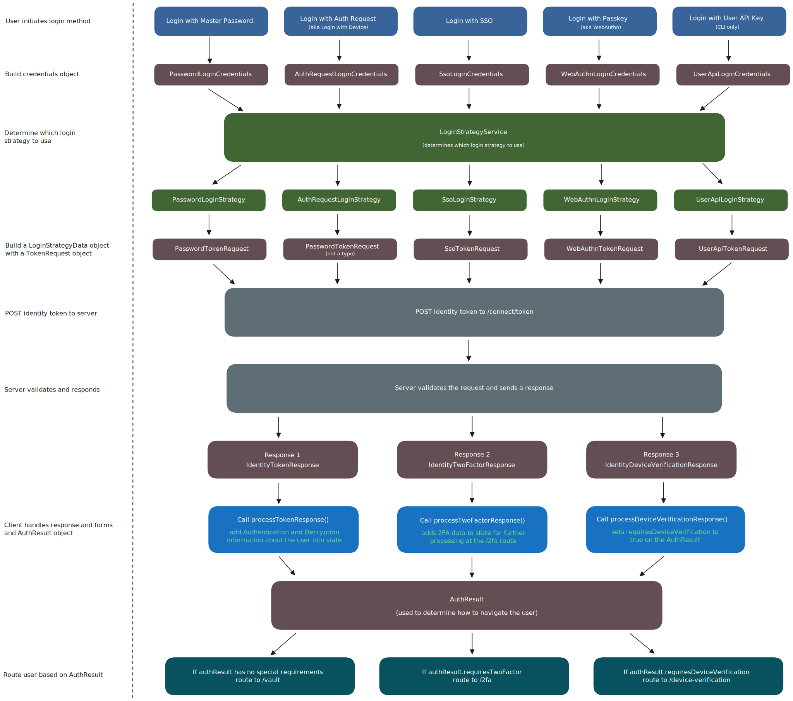

# Overview of Authentication at Bitwarden

<br>

> **Table of Contents**
>
> - [Authentication Methods](#authentication-methods)
> - [The Credentials Object](#the-credentials-object)
> - [The Login Strategy](#the-login-strategy)
> - [The `logIn()` and `startLogin()` Methods](#the-login-and-startlogin-methods)
> - [Handling the `AuthResult`](#handling-the-authresult)
> - [Final Diagram](#final-diagram)

<br>

## Authentication Methods

Bitwarden provides 5 methods for logging in to Bitwarden, as defined in our [`AuthenticationType`](https://github.com/bitwarden/clients/blob/main/libs/common/src/auth/enums/authentication-type.ts) enum. They are:

1. [Login with Master Password](https://bitwarden.com/help/bitwarden-security-white-paper/#authentication-and-decryption) &mdash; authenticate with an email address and master password
2. [Login with Device](https://bitwarden.com/help/log-in-with-device/) (aka Login with Auth Request) &mdash; authenticate with a one-time access code
3. [Login with SSO](https://bitwarden.com/help/about-sso/) &mdash; authenticate with an SSO Identity Provider (IdP) through SAML or OpenID Connect (OIDC)
4. [Login with Passkey](https://bitwarden.com/help/login-with-passkeys/) (aka Login with WebAuthn) &mdash; authenticate with a passkey
5. [Login with User API Key](https://bitwarden.com/help/personal-api-key/) &mdash; authenticate with an API key and secret

<br>

- Methods 1-4
  - Can be initiated from the `LoginComponent` on our Angular clients (at route `/login`)
  - Can be initiated from our CLI client
- Method 5
  - Can be initiated _only_ from our CLI client

<br>

While each login method relies on its own unique logic, this `README` discusses the logic that is _generally_ common to all login methods.

<br>

## The Credentials Object

When the user clicks the "submit" action for their specific login method, we first build a **credentials object**. This object gathers the core credentials needed to initiate the specific login method.

For example, when the user clicks "Log in with master password", we build a `PasswordLoginCredentials` object, which is defined as follows:

```typescript
export class PasswordLoginCredentials {
  readonly type = AuthenticationType.Password;

  constructor(
    public email: string,
    public masterPassword: string,
    public twoFactor?: TokenTwoFactorRequest,
    public masterPasswordPoliciesFromOrgInvite?: MasterPasswordPolicyOptions,
  ) {}
}
```

Notice that the `type` is automatically set to `AuthenticationType.Password`, and that the `PasswordLoginCredentials` object simply requires an `email` and `masterPassword` to initiate the login process.

Each authentication method builds it's respective credentials object, all of which are defined in [`login-credentials.ts`](https://github.com/bitwarden/clients/blob/main/libs/auth/src/common/models/domain/login-credentials.ts).

- `PasswordLoginCredentials`
- `AuthRequestLoginCredentials`
- `SsoLoginCredentials`
- `WebAuthnLoginCredentials`
- `UserApiLoginCredentials`

<br>

## The Login Strategy

The credentials object gets passed to our [`LoginStrategyService`](https://github.com/bitwarden/clients/blob/main/libs/auth/src/common/services/login-strategies/login-strategy.service.ts), which acts as an orchestrator that determines which specific **login strategy** should be used for the login process.

> [!IMPORTANT]
> Our authentication methods are handled by different [login strategies](https://github.com/bitwarden/clients/tree/main/libs/auth/src/common/login-strategies) in our code, making use of the [Strategy Pattern](https://refactoring.guru/design-patterns/strategy). Those strategies are:
>
> - `PasswordLoginStrategy`
> - `AuthRequestLoginStrategy`
> - `SsoLoginStrategy`
> - `WebAuthnLoginStrategy`
> - `UserApiLoginStrategy`
>
> Each of those strategies extend the base [`LoginStrategy`](https://github.com/bitwarden/clients/blob/main/libs/auth/src/common/login-strategies/login.strategy.ts), which houses common login logic.

The `LoginStrategyService` uses the `type` property on the credentials object to determine which of the specific login strategies should be used for the login process.

For example, the `PasswordLoginCredentials` object has `type = 0` (which is `AuthenticationType.Password`). This tells the `LoginStrategyService` to use the `PasswordLoginStrategy` for the login process.

<br>

## The `logIn()` and `startLogin()` Methods

Each login strategy has it's own implementation of the `logIn()` method. This method takes the credentials object as its sole argument and triggers a process that does the following at minimum:

1. **Build a `LoginStrategyData` Object**

   Each login strategy uses the credentials object to help build a type of `LoginStrategyData` object, which contains the data needed throughout the lifetime of the particular login strategy. Each login strategy has it's own class that implements the `LoginStrategyData` interface:
   - `PasswordLoginStrategyData`
   - `AuthRequestLoginStrategyData`
   - `SsoLoginStrategyData`
   - `WebAuthnLoginStrategyData`
   - `UserApiLoginStrategyData`

   So in our ongoing example that uses the "Login with Master Password" method, we would call `PasswordLoginStrategy.logIn(passwordLoginCredentials)`, which in turn would build a `PasswordLoginStrategyData` object that contains the data needed throughout the lifetime of the `PasswordLoginStrategy`. That object is defined like so:

   ```typescript
   export class PasswordLoginStrategyData implements LoginStrategyData {
     tokenRequest: PasswordTokenRequest;

     forcePasswordResetReason: ForceSetPasswordReason = ForceSetPasswordReason.None;
     localMasterKeyHash: string;
     masterKey: MasterKey;
     userEnteredEmail: string;
   }
   ```

   Each of the `LoginStrategyData` types have varying properties, but one property common to all is the `tokenRequest` property. The `tokenRequest` property holds some type of [`TokenRequest`](https://github.com/bitwarden/clients/tree/main/libs/common/src/auth/models/request/identity-token) object based on the login strategy:
   - `PasswordTokenRequest` &mdash; used by both Password and Auth Request login strategies
   - `SsoTokenRequest`
   - `WebAuthnTokenRequest`
   - `UserApiTokenRequest`

   This `TokenRequest` object is built during the `logIn()` call and is added to the `LoginStrategyData` object, as seen in the example above.

2. **Call the base `startLogin()` Method**

   After building the `LoginStrategyData` object with its `tokenRequest` property, we call the `startLogin()` method, which exists on the base `LoginStrategy` and is therefore common to all login strategies. The `startLogin()` method does the following:
   1. **Makes a `POST` request to the `/connect/token` endpoint on our Identity Server**
      - `REQUEST`

        The exact payload for this request is determined by the `TokenRequest` object. More specifically, the base `TokenRequest` object contains a `toIdentityToken()` method which can be overridden by the sub-classes (`PasswordTokenRequest`, etc.). This `toIdentityToken()` method takes the information in the `TokenRequest` object and turns it into the payload that gets sent to our `/connect/token` endpoint.

      - `RESPONSE`

        The Identity Server validates the request and then generates some type of `IdentityResponse`, which can be one of three types:
        - [`IdentityTokenResponse`](https://github.com/bitwarden/clients/blob/main/libs/common/src/auth/models/response/identity-token.response.ts)
          - This response means the user has been authenticated
          - The response contains:
            - Authentication information for the user
              - An access token, which is a JWT with claims about the user
              - A refresh token
            - Decryption information for the user
              - Includes the user's master-key-encrypted user key, along with their KDF settings
              - Includes an object that contains information about which decryption options the user has available to them

        - [`IdentityTwoFactorResponse`](https://github.com/bitwarden/clients/blob/main/libs/common/src/auth/models/response/identity-two-factor.response.ts)
          - This response means the user needs to complete two-factor authentication
          - The response contains information about the user's 2FA requirements, such as which 2FA providers they have available to them, etc.

        - [`IdentityDeviceVerificationResponse`](https://github.com/bitwarden/clients/blob/main/libs/common/src/auth/models/response/identity-device-verification.response.ts)
          - This response means the user needs to verify their new device via [new device verification](https://bitwarden.com/help/new-device-verification/)
          - The response contains a boolean property that simply states whether or not the device has been verified

   2. **Calls one of the `process*Response()` methods, each of which returns an [`AuthResult`](https://github.com/bitwarden/clients/blob/main/libs/common/src/auth/models/domain/auth-result.ts) object**
      - If `IdentityTokenResponse`, call `processTokenResponse()`
        - This method uses information from the `IdentityTokenResponse` object to set Authentication and Decryption information about the user into state.
          - `saveAccountInformation()` - initializes the account with information from the `IdentityTokenResponse` after successful login.
            - Adds the account to the `AccountService` and sets up the account profile in `StateService`
            - Sets the access token and refresh token to state
            - Sets the `userDecryptionOptions` to state

          - Sets cryptographic properties to state via `setMasterKey()`, `setUserKey()`, and `setPrivateKey()`

          - Sets a `forceSetPasswordReason` to state, if necessary

      - If `IdentityTwoFactorResponse`, call `processTwoFactorResponse()`
        - This method sets 2FA data to state for later processing at the `/2fa` route, and also adds the necessary data for the 2FA process to the `AuthResult`

      - If `IdentityDeviceVerificationResponse`, call `processDeviceVerificationResponse()`
        - This method simply sets `requiresDeviceVerification` to `true` on the `AuthResult`

<br>

## Handling the `AuthResult`

The `AuthResult` object returned from the `process*Response()` method contains information that will be used to determine how to navigate the user after authentication.

For example, if the `AuthResult` contains:

- `requiresTwoFactor` &mdash; then navigate user to `/2fa`
- `requiresDeviceVerification` &mdash; then navigate user to `/device-verification`
- If there are no additional requirements according to the `AuthResult`, then navigate user to `/vault`

<br>

## Diagram of Authentication Flows

Here is a high-level overview of what all of this looks like in the end.

<br>


