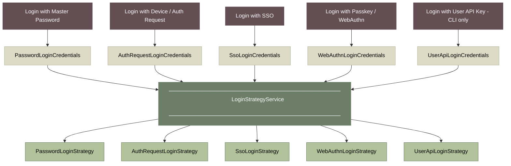
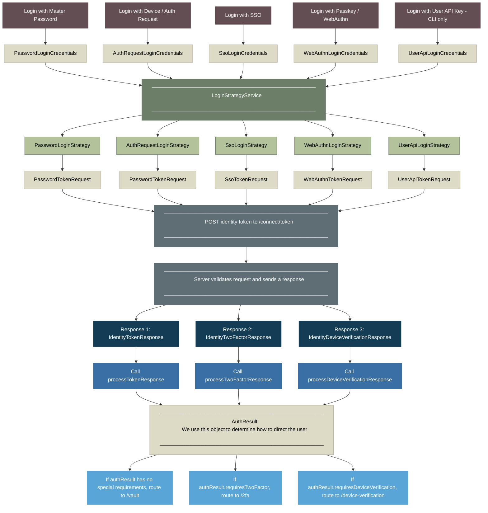

# Overview of Authentication at Bitwarden

<br>

> **Table of Contents**
>
> - [Authentication Methods](#authentication-methods)
> - [The Credentials Object](#the-credentials-object)
> - [The Login Strategy](#the-login-strategy)
> - [The `logIn()` and `startLogin()` Methods](#the-login-and-startlogin-methods)
> - [Handling the `AuthResult`](#handling-the-authresult)
> - [Final Diagram](#final-diagram)

<br>

## Authentication Methods

Bitwarden provides 5 methods for logging in to Bitwarden, as defined in our [`AuthenticationType`](https://github.com/bitwarden/clients/blob/main/libs/common/src/auth/enums/authentication-type.ts) enum. They are:

1. [Login with Master Password](https://bitwarden.com/help/bitwarden-security-white-paper/#authentication-and-decryption) &mdash; authentication with an email address and master password
2. [Login with Device](https://bitwarden.com/help/log-in-with-device/) (aka Login with Auth Request) &mdash; authentication with a one-time access code
3. [Login with SSO](https://bitwarden.com/help/about-sso/) &mdash; authentication with an SSO Identity Provider (IdP) through SAML or OpenID Connect (OIDC)
4. [Login with Passkey](https://bitwarden.com/help/login-with-passkeys/) (aka Login with WebAuthn) &mdash; authentication with a passkey
5. [Login with User API Key](https://bitwarden.com/help/personal-api-key/) &mdash; authentication with an API key and secret.

<br>

- Methods 1-4
  - Can be initiated from the `LoginComponent` on our Angular clients (route `/login`)
  - Can be initiated from our CLI client
- Method 5
  - Can be initiated _only_ from our CLI client

<br>

While each login method relies on its own unique logic, this `README` discusses the logic that is _generally_ common to all login methods.

<br>

## The Credentials Object

When the user clicks the "submit" action for their specific login method, we build a **credentials object**. This object gathers the core credentials needed to initiate the specific login method.

For example, when the user clicks "Log in with master password", we build a `PasswordLoginCredentials` object, which is defined as follows:

```typescript
export class PasswordLoginCredentials {
  readonly type = AuthenticationType.Password;

  constructor(
    public email: string,
    public masterPassword: string,
    public twoFactor?: TokenTwoFactorRequest,
    public masterPasswordPoliciesFromOrgInvite?: MasterPasswordPolicyOptions,
  ) {}
}
```

Notice that the `type` is automatically set to `AuthenticationType.Password`, and that the `PasswordLoginCredentials` object simply requires an `email` and `masterPassword` to initiate the login process.

Each authentication method builds it's respective credentials object, as defined in [login-credentials.ts](https://github.com/bitwarden/clients/blob/main/libs/auth/src/common/models/domain/login-credentials.ts).

- `PasswordLoginCredentials`
- `AuthRequestLoginCredentials`
- `SsoLoginCredentials`
- `WebAuthnLoginCredentials`
- `UserApiLoginCredentials`

<br>

## The Login Strategy

The credentials object gets forwarded to our `LoginStrategyService`, which acts as an orchestrator to determine which specific **login strategy** should be used for the login process.

> [!IMPORTANT]
> Our authentication methods are handled by different [login strategies](https://github.com/bitwarden/clients/tree/main/libs/auth/src/common/login-strategies) in our code, making use of the [Strategy Pattern](https://refactoring.guru/design-patterns/strategy). Those strategies are:
>
> - `PasswordLoginStrategy`
> - `AuthRequestLoginStrategy`
> - `SsoLoginStrategy`
> - `WebAuthnLoginStrategy`
> - `UserApiLoginStrategy`
>
> Each of those strategies extend the base `LoginStrategy`, which houses common login logic.

The `LoginStrategyService` uses the `type` property on the credentials object to determine which of the specific login strategies should be used for the login process.

For example, the `PasswordLoginCredentials` object has `type = 0` (which is `AuthenticationType.Password`). This tells the `LoginStrategyService` to use the `PasswordLoginStrategy` for the login process.

Here is what all of this looks like so far:



<br>

## The `logIn()` and `startLogin()` Methods

Each login strategy has it's own implementation of the `logIn()` method, which takes the credentials object as its sole argument and triggers a process that does the following _at minimum_:

<details>
  <summary><strong>1 - Builds a <code>LoginStrategyData</code> and <code>TokenRequest</code> object</strong></summary>

- Each login strategy uses the credentials object to help build a type of the `LoginStrategyData` object, which contains data needed throughout the lifetime of the login strategy. Each login strategy has it's own class that implements the `LoginStrategyData` interface:
  - `PasswordLoginStrategyData`
  - `AuthRequestLoginStrategyData`
  - `SsoLoginStrategyData`
  - `WebAuthnLoginStrategyData`
  - `UserApiLoginStrategyData`

- Each `LoginStrategyData` object has different properties, but the most important property common to all `LoginStrategyData` objects is the `tokenRequest` property, which holds some type of the `TokenRequest` object, and is formed based on the specific login strategy:
  - `PasswordTokenRequest` &mdash; used by both Password and Auth Request login strategies
  - `SsoTokenRequest`
  - `WebAuthnTokenRequest`
  - `UserApiTokenRequest`

</details>

<details>
  <summary><strong>2 - Calls the base <code>startLogin()</code> method</strong></summary>
  
  - After building the `LoginStrategyData` object, we call the `startLogin()` method, which exists on the base `LoginStrategy` and is therefore common to all of the login strategies. The `startLogin()` method does two main things:

    [1] - <em>Makes a `POST` request to the `/connect/token` endpoint on our Identity Server</em>

      - `REQUEST` &mdash; The contents of the payload for this request are determined by the `toIdentityToken()` method that exists on the base `TokenRequest` object (which can be overridden by the sub-classes). This method translates the information in the `TokenRequest` into the payload that will be sent to the `/connect/token` endpoint on our Identity Server.

      - `RESPONSE` &mdash; The Identity Server validates the request based on the grant type, and then generates a response that will be some form of `IdentityResponse`. There are three possibilities:
        - [`IdentityTokenResponse`](https://github.com/bitwarden/clients/blob/main/libs/common/src/auth/models/response/identity-token.response.ts)

          - This response contains means the user has been authenticated. The response contains:
            - Authentication information for the user (access token, refresh token)
            - Decryption information for the user

        - [`IdentityTwoFactorResponse`](https://github.com/bitwarden/clients/blob/main/libs/common/src/auth/models/response/identity-two-factor.response.ts)
          - This response means that the user will need to complete Two Factor Authentication, and the response contains information about the user's 2FA requirements (i.e. which 2FA providers they have available to them, etc.)

        - [`IdentityDeviceVerificationResponse`](https://github.com/bitwarden/clients/blob/main/libs/common/src/auth/models/response/identity-device-verification.response.ts)
          - This reponse means that the user will need to verify their new device.

    [2] - <em>Calls one of the `process*Response()` methods based on the type of `IdentityResponse`, each of which returns an `AuthResult`</em>

      - If `IdentityTokenResponse`, call `processTokenResponse()`

        - This method uses information from the `IdentityTokenResponse` object to set Authentication and Decryption information about the user into state.

          - `saveAccountInformation()` - initializes the account with information from the `IdentityTokenResponse` after successful login.

            - Adds the account to the `AccountService` and sets up the account profile in `StateService`
            - Sets the access token and refresh token to state
            - Sets the `userDecryptionOptions` to state

          - Sets the user's cryptographic properties to state via `setMasterKey()`, `setUserKey()`, and `setPrivateKey()`

          - Sets a `forceSetPasswordReason` in state, if necessary.

      - If `IdentityTwoFactorResponse`, call `processTwoFactorResponse()`
        - This method adds the necessary data for the 2FA process to the `AuthResult`

      - If `IdentityDeviceVerificationResponse`, call `processDeviceVerificationResponse()`
        - This method simply sets `requiresDeviceVerification` to `true` on the `AuthResult`

</details>

<details>
  <summary><strong>3 - Returns an <code>AuthResult</code> object</strong></summary>
  
  - The `AuthResult` object contains information that will be used to determine how to navigate the user after authentication.

</details>

<br>

## Handling the `AuthResult`

The `AuthResult` object returned from the `process*Response()` method contains information that will be used to determine how to navigate the user after authentication.

For example, if the `AuthResult` contains:

- `requiresTwoFactor` &mdash; then navigate user to `/2fa`
- `requiresDeviceVerification` &mdash; then navigate user to `/device-verification`
- If there are no additional requirements according to the `AuthResult`, then navigate user to `/vault`

<br>

## Final Diagram

Here is a high-level overview of what all of this looks like in the end:


